# Connectly — Social Media Platform (AVIP 2026 Task 5)

A polished full-stack social media platform built with React + TypeScript, Node.js + Express + TypeScript, and PostgreSQL/Neon.

## Task 5 Requirements Covered

- User profile create/update
- Text posts and image/media references
- Image upload from a local file or image URL
- Newest-first feed
- Search the home feed by people/posts/topics
- Like/unlike with red heart UI
- Commenting with persistent storage
- Share action using native Web Share where available, with clipboard fallback
- Notification center for likes/comments with unread count
- Dark/light theme toggle with local persistence
- JWT authentication and protected post/interactions
- Sample dataset with media-enabled posts

## Stack

Frontend: React, TypeScript, Vite, React Router, Lucide React
Backend: Node.js, Express, TypeScript, JWT, bcryptjs, Zod
Database: PostgreSQL / Neon

## Local Setup

1. Run `database/schema.sql` in the new `connectly-social-media` Neon project.
2. Create `backend/.env` from `backend/.env.example`.
3. Start backend:

```bash
cd backend
npm install
npm run dev
```

4. Start frontend in another terminal:

```bash
cd frontend
npm install
npm run dev
```

The backend accepts local frontend origins on `5173` and `5174`, while `CLIENT_URL` controls the production origin.

## Media Upload

The post composer supports two options:

- **Upload image** — reads a local image into a data URL and stores it in the existing `media_url` field. Recommended demo image size: under 2.5 MB.
- **Image URL** — stores an external `http(s)` media URL.

This approach is intentionally simple for the internship demo. A production application would normally use object storage/CDN instead of storing image data in a relational row.

## Useful Routes

- `GET /api/health`
- `POST /api/auth/register`
- `POST /api/auth/login`
- `GET /api/auth/me`
- `GET /api/profile/me`
- `PUT /api/profile/me`
- `GET /api/posts`
- `GET /api/posts?search=react`
- `GET /api/posts/liked`
- `GET /api/posts/commented`
- `POST /api/posts`
- `DELETE /api/posts/:postId`
- `POST /api/posts/:postId/like`
- `GET /api/posts/:postId/comments`
- `POST /api/posts/:postId/comments`
- `GET /api/notifications`
- `PUT /api/notifications/:notificationId/read`
- `PUT /api/notifications/read-all`

## Demo Accounts

All three seeded users use:

```text
Password: DemoPass123!
```

Example accounts:

```text
ravindi.demo@connectly.app
mayuri.demo@connectly.app
suhitha.demo@connectly.app
```

## Security

- Passwords are stored as bcrypt hashes.
- JWT protects private API routes.
- Zod validates posts and comments.
- Secrets belong in `.env` and must never be committed.

## User activity pages

- `/likes` — posts the signed-in user has liked.
- `/comments` — posts the signed-in user has commented on.
- Explore and Photos were intentionally removed from the main navigation.

## Authentication flow

Registration creates the account and redirects back to `/login`; the user must explicitly sign in before entering the protected application.

## Branding assets

The login and registration states use the supplied Connectly community background artwork in `frontend/public/connectly-auth-bg.png`.

## Screenshots

### 1. Registration & Authentication

#### Register Page

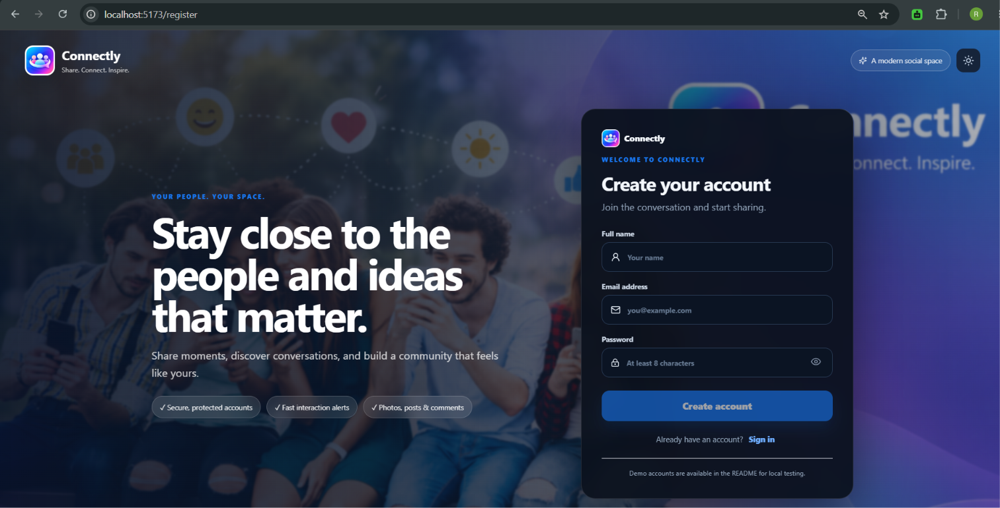

#### Registration Successful

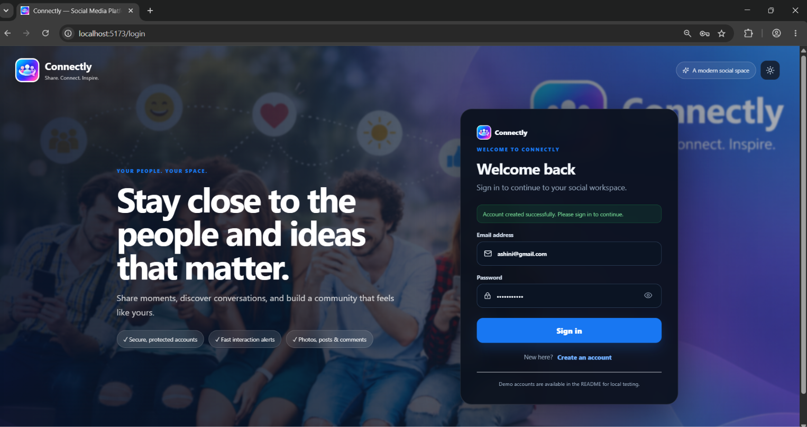

#### Login Page

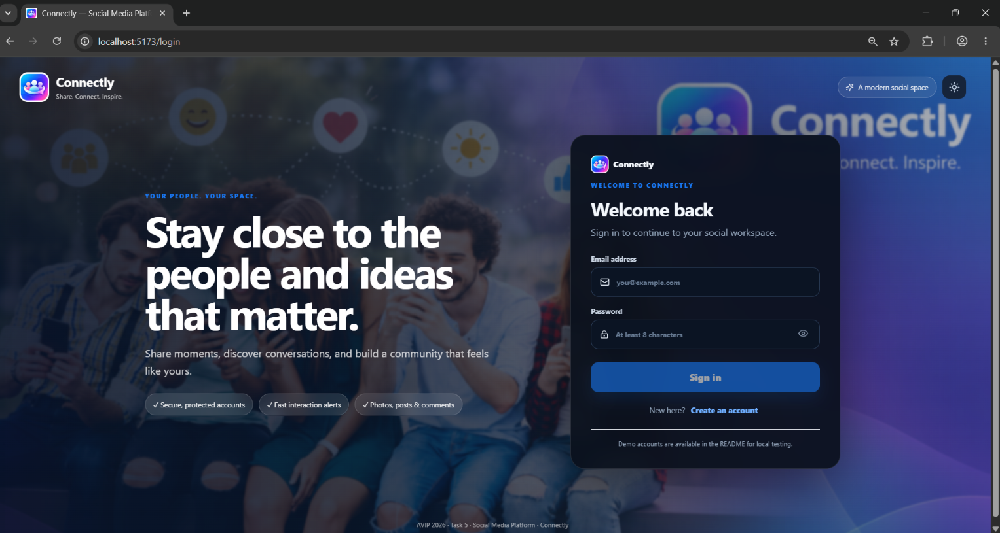

---

### 2. Home Feed

#### Connectly Home Feed

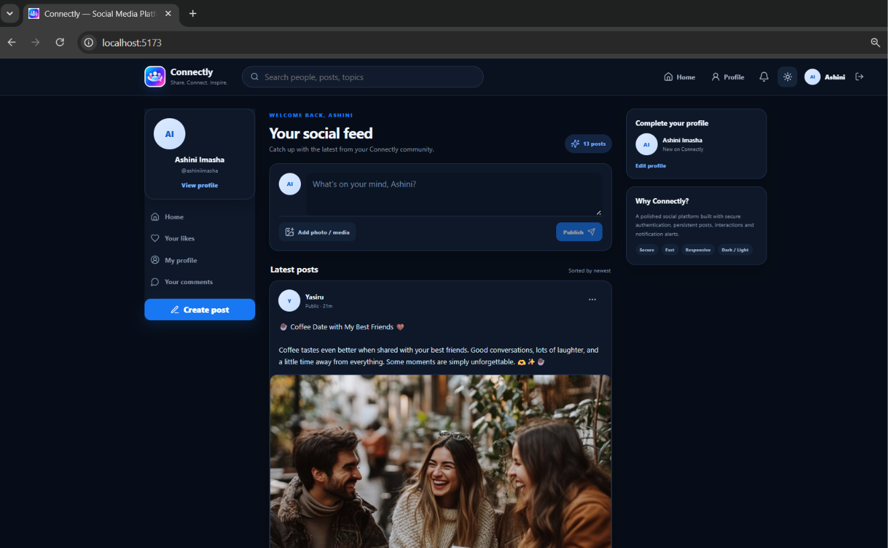

---

### 3. Creating Posts

#### Create Post

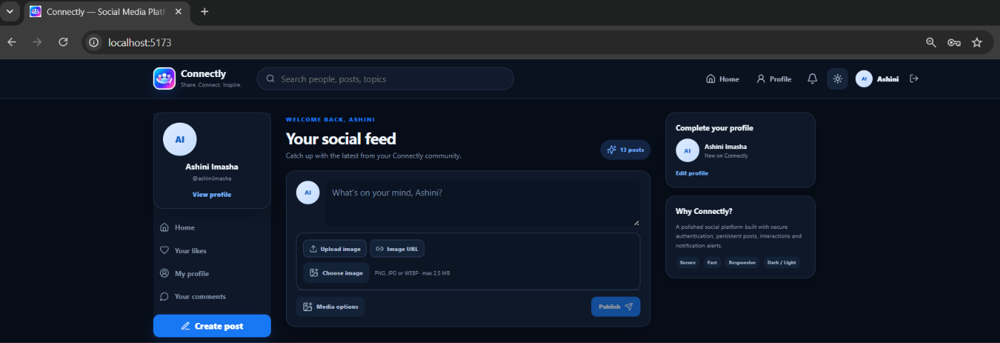

#### Image Post

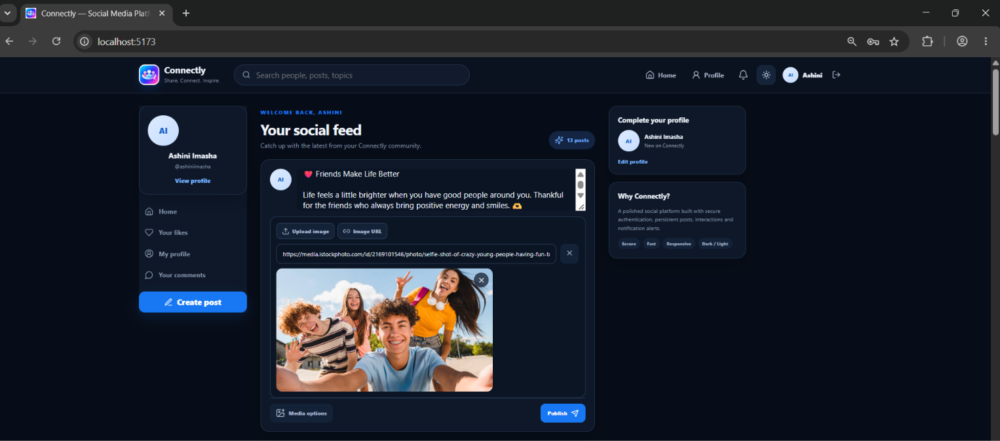

---

### 4. Post Interactions

#### Likes & Comments

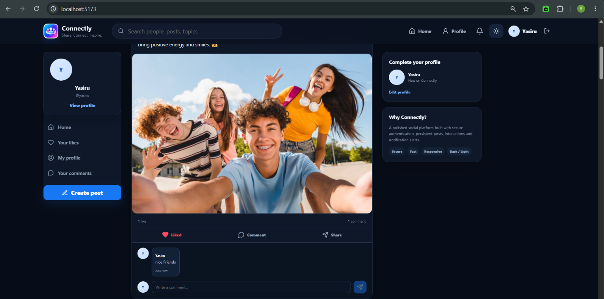

#### Notifications

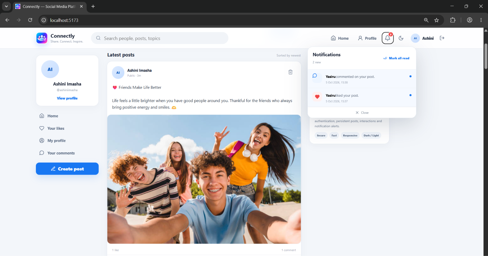

---

### 5. Profile Management

#### Profile Editing

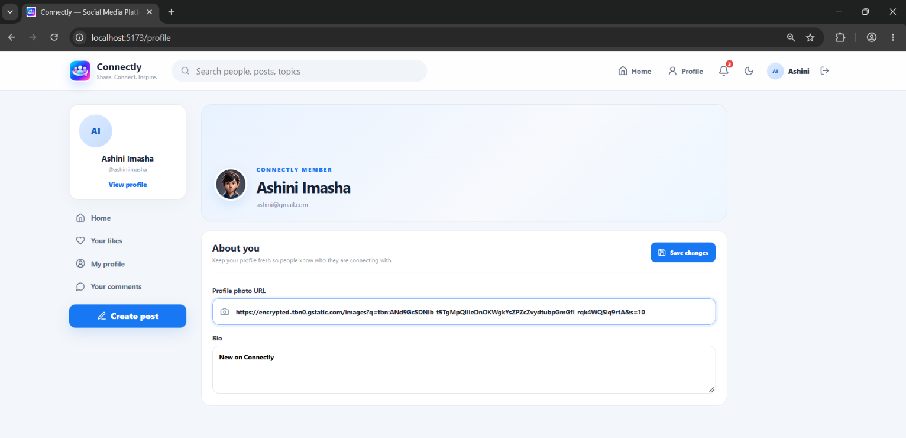

#### Updated Profile Picture

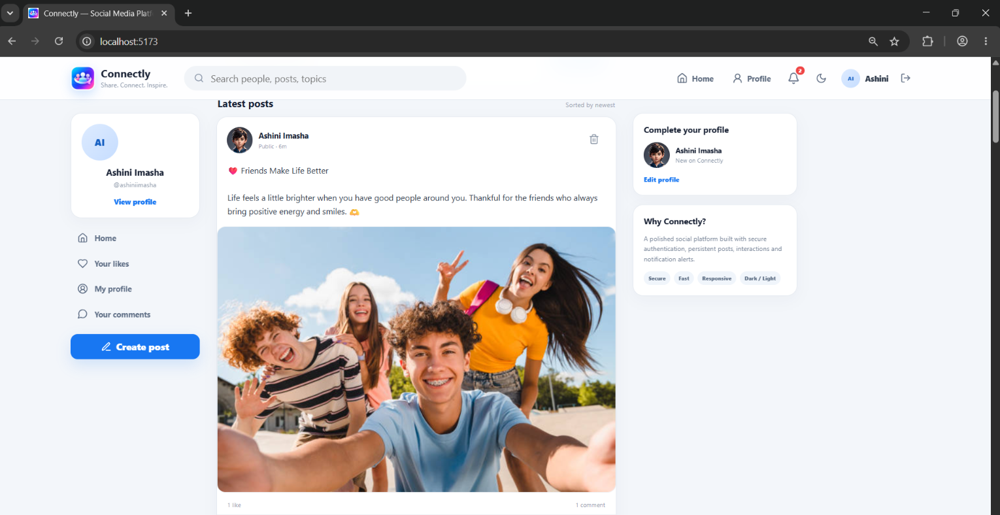

---

### 6. Theme Support

#### Dark Theme

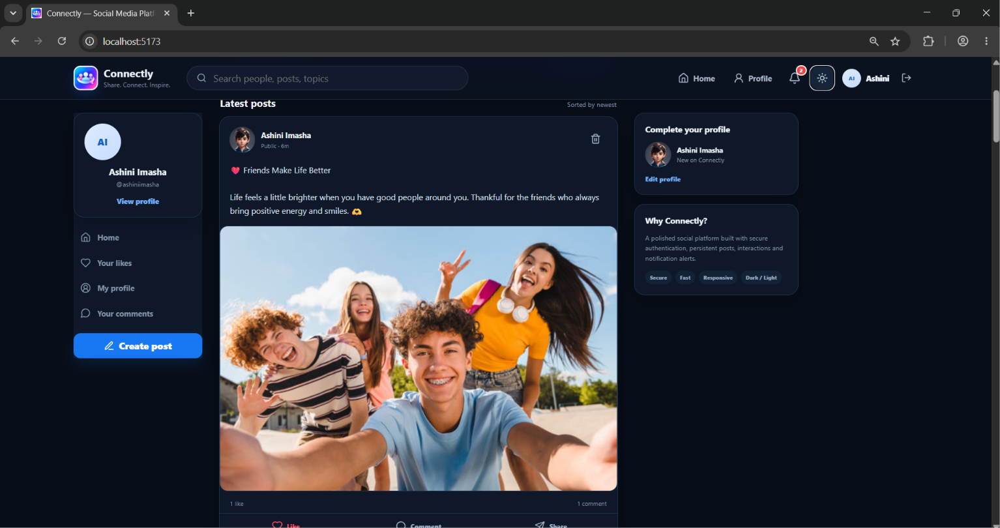

---

### 7. Database Persistence

#### Neon PostgreSQL Database

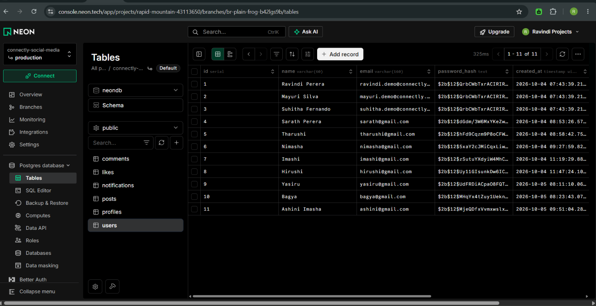

---

### 8. Additional Application Evidence

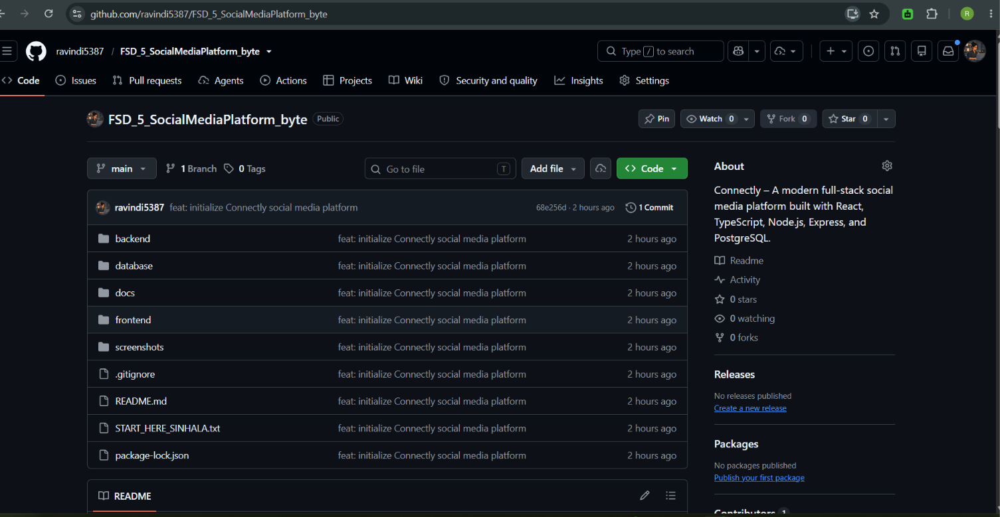

Live Demo: https://fsd-5-social-media-platform-byte-et.vercel.app

Backend API: https://fsd-5-social-media-platform-byte.vercel.app/api

GitHub: https://github.com/ravindi5387/FSD_5_SocialMediaPlatform_byte
